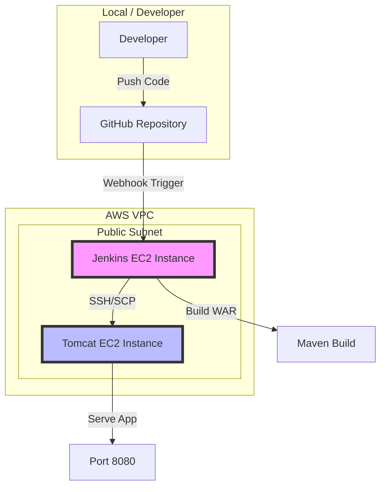

# Architecture Diagram

## Description
1.  **Developer** pushes code to the `master` branch of the GitHub repository.
2.  **GitHub** sends a webhook notification to **Jenkins**.
3.  **Jenkins** triggers a pipeline that:
    - Checks out the latest code.
    - Uses **Maven** to build a Java WAR artifact.
    - Uses **SSH/SCP** to deploy the artifact to the **Tomcat** server.
4.  **Tomcat** serves the application on port 8080.
